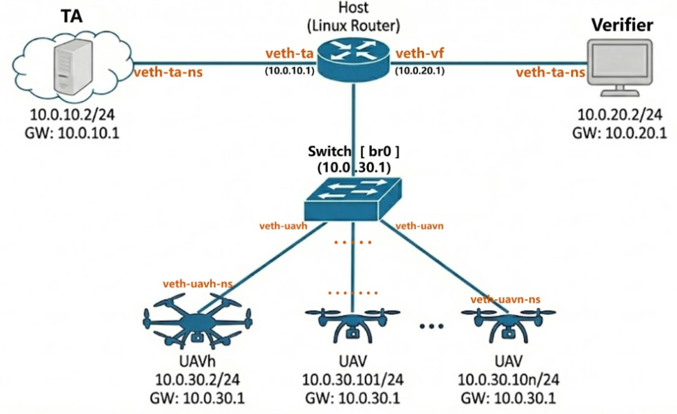

# RTS-UAV: Runtime Threshold Signature-Based Unmanned Aerial Vehicle Swarm Authentication with Autonomous Splitting Support
This repository provides the implementation of **RTS**, a runtime threshold signature scheme proposed in our paper. It also includes implementations of three existing signature schemes — **FROST**, **MTS**, and **MuSig2** — which are used for experimental comparison.

---

## ⚙️ Build Instructions


### 0️⃣ Install Required Dependencies

Run the following command to install all dependencies necessary for building this project:

> `m4`: required for building GMP
> 
> `libboost-all-dev`: required for building `websocketpp`
> 
> Other standard tools: `git`, `cmake`, `python3`, `build-essential`

```bash
sudo apt update
sudo apt install -y git cmake python3 build-essential m4 libboost-all-dev
```

### 1️⃣ Clone repository with submodules and build with CMake:

Using `-DCMAKE_BUILD_TYPE=Release` `-DBENCHMARK_ENABLE_WERROR=OFF` to avoid debug-mode overhead and prevent benchmark warnings from being treated as errors during compilation.
```bash
git clone --recurse-submodules https://github.com/rookie-papers/RTS-UAV.git
cd RTS-UAV
mkdir build && cd build
cmake -DCMAKE_BUILD_TYPE=Release -DBENCHMARK_ENABLE_WERROR=OFF ..
make -j
```

### 2️⃣ Running Benchmarks
Each scheme builds into an individual benchmark executable.

```bash
./benchmark_RTS
./benchmark_FROST
./benchmark_MTS
./benchmark_MuSig2
```

### 3️⃣ Threshold Configuration

All signature schemes in this project use a default threshold value of **128**. If you want to test performance with a different threshold value, please manually modify the corresponding source files by updating the following line:

```cpp
#define T 128   // Change this to your desired threshold [MTS & FROST]
#define TM 128  // Change this to your desired threshold [RTS]
#define N 128   // Change this to your desired threshold [MuSig2]
```

## 📦 Dependencies

All dependencies are included as Git submodules:

| Library          | Source URL                                                                       |
|------------------|----------------------------------------------------------------------------------|
| GMP              | [github.com/rookie-papers/GMP](https://github.com/rookie-papers/GMP) (via fork with CMake support) |
| MIRACL Core      | [github.com/miracl/core](https://github.com/miracl/core)                         |
| Google Benchmark | [github.com/google/benchmark](https://github.com/google/benchmark)               |
| Websocketpp      | [github.com/zaphoyd/websocketpp](https://github.com/zaphoyd/websocketpp)               |

You don't need to install them manually — they are automatically configured and built with CMake.

---

## 🌐 Network Simulation Experiment

In addition to pure cryptographic benchmarking, this repository contains a
high-fidelity network simulation environment located in the `netSim` directory.
This environment emulates a distributed UAV swarm architecture using Linux 
network namespaces (`netns`) and traffic control (tc) to validate the protocol 
under realistic network conditions.

### 0️⃣ File Structure

The netSim directory is structured as follows:

```
netSim/
├── CMakeLists.txt          # CMake build configuration
├── include/                # Header files for system entities
│   ├── TA.h
│   ├── UAV.h
│   ├── UAVh.h
│   └── Verifier.h
├── scripts/                # Network automation and control scripts
│   ├── build_uav_net.sh    # Builds virtual network topology (Namespaces, Bridges, Veth)
│   ├── config.env          # Config: drone count, threshold, latency, bandwidth, loss, etc.
│   ├── run_uavs.sh         # Batch script to launch UAV processes
│   ├── tc_bandwidth.sh     # Applies bandwidth limit rules (Traffic Control)
│   ├── tc_latency.sh       # Applies network latency rules (Traffic Control)
│   ├── tc_loss.sh          # Applies packet loss simulation (Traffic Control)
│   └── teardown.sh         # Cleans up namespaces and restores network settings
└── src/                    # C++ source code implementation
    ├── TA.cpp
    ├── UAV.cpp
    ├── UAVh.cpp
    └── Verifier.cpp
```

### 1️⃣ System Architecture and Network Topology

This experiment simulated the four key entities involved in the identity authentication of 
unmanned aerial vehicle (UAV) swarms in our paper, whose functions are as follows:

> **TA:** The Trust Authority, acting as the root of trust for system initialization and key distribution.
> 
> **Verifier:** The ground station or base station that initiates authentication challenges to the swarm.
> 
> **UAVh:** The Swarm Head, responsible for coordinating the swarm and aggregating partial signatures from members.
> 
> **UAVs:** Ordinary swarm member nodes that perform signing operations and generate partial signatures.

To simulate the network environment described in the paper and mimic physical isolation, each entity runs 
in its own independent **Network Namespace (`netns`)**. This design ensures that every node possesses a 
dedicated protocol stack, routing table, and virtual network interface. The entire virtual network topology 
can be instantiated automatically by executing the `build_uav_net.sh` script. To enable readers to have a 
clearer understanding of the virtual network architecture, we present it graphically as follows



Here is a plain text version of the network topology diagram

```
                       Host (Linux Router)
                  +--------------------------+
                  | GW: 10.0.10.1, 10.0.20.1 |
                  +------------+-------------+
                               |
           +-------------------+-------------------+
           |                   |                   |
      veth-ta-ns               |              veth-vf-ns
           |                   |                   |
   +-------+-------+           |           +-------+-------+
   |      TA       |           |           |   Verifier    |
   |  10.0.10.2    |           |           |   10.0.20.2   |
   +---------------+           |           +---------------+
                               |
                               | br-swarm (10.0.30.1)
                       +-------+-------+
                       |  Switch [br0] |
                       +-------+-------+
                               |
        +----------------------+-----------------------+
        |                      |                       |
   veth-uavh-ns           veth-uavn-ns            veth-uavn-ns
        |                      |                       |
+-------+-------+      +-------+-------+       +-------+-------+
|     UAVh      |      |     UAV 1     |  ...  |     UAV n     |
|   10.0.30.2   |      |  10.0.30.101  |  ...  |  10.0.30.10n  |
+---------------+      +---------------+       +---------------+
```

As depicted in the figure, communication paths between these entities are categorized into two types:


> **Internal Communication:** A virtual bridge (`br-swarm`) connects all UAV nodes (UAVh and UAVs)
  via `veth pairs` to simulate a high-speed Ad-hoc LAN for intra-swarm communication.
> 
> **External Communication:** Routing between the Verifier, Swarm Head,
  and TA is managed by the host kernel to simulate remote WAN.

**Communication Workflow Summary:**  
The overall workflow begins with the registration phase, where all entities connect to the TA to request
public parameters and keys. During the authentication phase, the Verifier sends a challenge to the
swarm head (UAVh). Upon receiving the request, the UAVh broadcasts a signing command to all swarm members
(UAVs) in parallel. Each member computes a partial signature and sends it back to the UAVh.
Finally, the UAVh aggregates these partial signatures and returns it to the Verifier for validation.


### 2️⃣ How to Run the Experiment

You can run the entire experiment sequence using the following commands. Ensure you have compiled the project first.

```bash
# Enter the simulation directory
cd build/netSim

# 1. Build the virtual network topology (Namespaces, Bridges, Veth pairs)
sudo ./scripts/build_uav_net.sh

# 2. (Optional) Configure network conditions
# Specific parameters (e.g., DELAY=50ms, RATE=128kbit, LOSS=10%) are defined in 'config.env'.
# You can edit 'config.env' to adjust these values before running the scripts below:
sudo ./scripts/tc_latency.sh     # Apply latency settings from config.env
# sudo ./scripts/tc_bandwidth.sh # Apply bandwidth limits from config.env
# sudo ./scripts/tc_loss.sh      # Apply packet loss settings from config.env

# ========================================================================================
# NOTE: The commands below use '&' to run processes in the background.
# To view real-time logs and outputs from each entity, it is recommended to open 
# SEPARATE terminal windows for Steps 3, 4, and 5, and run them WITHOUT the trailing '&'.
# ========================================================================================

# 3. Start the Trusted Authority (TA) first
sudo ip netns exec TA ./TA_netSim &

# 4. Start all swarm member nodes (UAVs) in batch
sudo ./scripts/run_uavs.sh

# 5. Start the Swarm Head (UAVh) to listen for requests
sudo ip netns exec UAVh ./UAVh_netSim &

# 6. Start the Verifier to initiate the authentication challenge
# (This will output the total authentication time and verification result)
sudo ip netns exec Verifier ./Verifier_netSim

# 7. Cleanup: Remove namespaces and restore network settings
sudo ./scripts/teardown.sh
```


### 3️⃣ Latency Analysis

After running the experiment as described above, under the default configuration (64 UAVs) with no 
traffic control rules, the baseline authentication time—representing pure computation overhead—is 
approximately **230ms** (tested on an 11th Gen Intel® Core™ i7-11700K @ 3.60GHz). 
However, after executing `tc_latency.sh` to introduce a **50ms Egress Delay** to both the Verifier 
and the Swarm Head (UAVh), the total authentication time rises to approximately **530ms**. 
This indicates a network-induced overhead of **300ms**.

This result might initially seem counter-intuitive: why does a 50ms physical link delay result 
in a 300ms total increase? The discrepancy arises from the **TCP 3-way handshake** mechanism. 
Crucially, the Linux TC rules are applied strictly to **Egress** traffic on the Verifier and UAVh, 
while internal swarm communication remains near 0ms. We decompose this **300ms** network overhead 
into the following three stages:

**Timeline Breakdown:**
> **0-150ms (External):** Verifier $\leftrightarrow$ UAVh connection establishment (TCP 3-way handshake + Request Piggybacking).
> 
> **150-250ms (Internal):** UAVh $\leftrightarrow$ UAV connection and signature collection (Intra-swarm communication).
> 
> **250-300ms (External):** UAVh returns the aggregated signature to the Verifier.

To provide a clearer understanding of these interactions, the sequence diagram of the entire communication process is presented below:

```
  Verifier                    UAVH (Cluster Head)                      UAV 
    |                                  |                                |
  0 +---- ① TCP SYN -----------------> |                                |
    |        (50ms delay)              |                                |
    |                                  |                                |
 50 |<--- ② TCP [S.] (SYN-ACK) --------+                                |
    |        (50ms delay)              |                                |
    |                                  |                                |
100 +---- ③ TCP + Request -----------> |                                |
    |    (Piggybacking / 50ms)         |                                |
    |                                  |                                |
150 |                                  +---- ① TCP SYN ---------------->|
    |                                  |        (50ms delay)            |
    |                                  |                                |
200 |                                  |<--- ② TCP [S.] (SYN-ACK) ------+
    |                                  |      (Internal / ~0ms)         |
    |                                  |                                |
200 |                                  +---- ③ TCP + Request Sig ------>|
    |                                  |        (50ms delay)            |
    |                                  |                                |
250 |                                  |<--- Return Signature ----------+
    |                                  |      (Internal / ~0ms)         |
    |                                  |                                |
250 |<--- Return TransSig -------------+                                |
    |      (50ms delay)                |                                |
    |                                  |                                |
300 +        (Finish)                  |                                |
    |                                  |                                |
```


---

## 🚀 Real Network Deployment

While the netSim directory focuses on single-machine virtualization, the RTS-websocket directory
contains the implementation designed for physical deployment experiments. This version allows entities
to run on different physical devices (or Virtual Machines) and communicate via actual TCP/IP interfaces
(e.g., Wi-Fi, Ethernet).


### 0️⃣ File Structure

The `RTS-websocket` directory is structured as follows:

```text
RTS-websocket/
├── CMakeLists.txt          # CMake build configuration
├── include/                # Header files for system entities and scheme
│   ├── RTS.h               # Definitions for the Runtime Threshold Signature scheme
│   ├── TA.h
│   ├── UAV.h
│   ├── UAVh.h
│   └── Verifier.h
├── scheme/                 # Core cryptographic implementation
│   └── RTS.cpp             # Implementation of the RTS cryptographic logic
├── scripts/                # Network control scripts for physical interfaces
│   ├── clean_tc.sh         # Restores normal network conditions (removes TC rules)
│   ├── config.env          # Global Config: drone count, max threshold, bandwidth, latency, etc.
│   ├── run_uavs.sh         # Batch script to launch multiple UAV processes
│   ├── stop_all.sh         # Utility script to terminate all running processes
│   ├── tc_bandwidth.sh     # Applies bandwidth limits to physical NICs
│   ├── tc_latency.sh       # Applies network latency to physical NICs
│   └── tc_loss.sh          # Applies packet loss simulation to physical NICs
└── src/                    # C++ source code for network entities (WebSocket-based)
    ├── TA.cpp
    ├── UAV.cpp
    ├── UAVh.cpp
    └── Verifier.cpp
```

### 1️⃣ Deployment Architecture

This setup mirrors the topology simulated in netSim but operates on real network stacks. A typical
experimental setup (as used in our paper) includes:

> **Machine A** (Virtual Machine 1): Runs the Trusted Authority (TA) and the Verifier.
> 
> **Machine B** (Virtual Machine 2): Runs the Swarm Head (UAVh).
> 
> **Machine C** (Amov P600 UAV): Runs the Swarm Members (UAVs).
> 
> **Note:** Since physical UAVs are limited, a single P600 on-board computer can simulate a cluster 
> by spawning multiple processes listening on different ports.


### 2️⃣ How to Run

Since this deployment involves multiple physical UAV or VMs, you must configure, 
build, and execute the programs on their respective hosts.

**1. Configuration**

You must manually update the IP addresses to match your actual local network environment. 
Edit the corresponding .cpp source files for the four entities (located in src/) to ensure 
their connection parameters (IPs and Ports) align with the physical machines hosting them. 
If you have not modified the cloned source code structure, you simply need to update the 
target connection IP within each entity's source file.


**2. On each machine (VMs and P600), compile the code**

```bash
mkdir build && cd build
cmake -DCMAKE_BUILD_TYPE=Release -DBENCHMARK_ENABLE_WERROR=OFF ..
make -j
cd RTS-websocket
```

**3. Execute the corresponding commands on the respective devices.**

```bash
# 1. (Important) Configuration
# Edit `*.cpp*`  to ensure the IP addresses match your actual local network IP addresses.
# and ports for your physical devices before running.

# 2. (Optional) Configure network conditions on the Host NIC
# Unlike netSim, these scripts apply TC rules to the PHYSICAL interface (e.g., eth0, wlan0).
# Ensure the interface name in 'config.env' is correct.
sudo ../scripts/tc_latency.sh ens33      # Apply latency to the physical network card
# sudo ../scripts/tc_bandwidth.sh ens33  # Apply bandwidth limits
# sudo ../scripts/tc_loss.sh ens33       # Apply packet loss

# ========================================================================================
# NOTE: The commands below use '&' to run processes in the background.
# To view real-time logs and outputs from each entity, it is recommended to open 
# SEPARATE terminal windows for Steps 3, 4, and 5, and run them WITHOUT the trailing '&'.
# ========================================================================================

# 3. Start the Trusted Authority (TA) first (Runs on Machine A)
./TA_exec

# 4. Start all swarm member nodes (UAVs) in batch (Runs on Machine C / Amov P600)
# This script spawns multiple processes listening on different ports defined in config.env
./scripts/run_uavs.sh

# 5. Start the Swarm Head (UAVh) to listen for requests (Runs on Machine B)
./UAVh_exec 

# 6. Start the Verifier to initiate the authentication challenge (Runs on Machine A)
# This will output the total authentication time and verification result
./Verifier_exec

# 7. Cleanup: Remove TC rules from physical interfaces
sudo ../scripts/clean_tc.sh
# Note: Use '../scripts/stop_all.sh' if you need to kill all background processes.
```

### 3️⃣ Result Analysis

If the network conditions among various entities are good, the operation result will be similar 
to the above network simulation result.